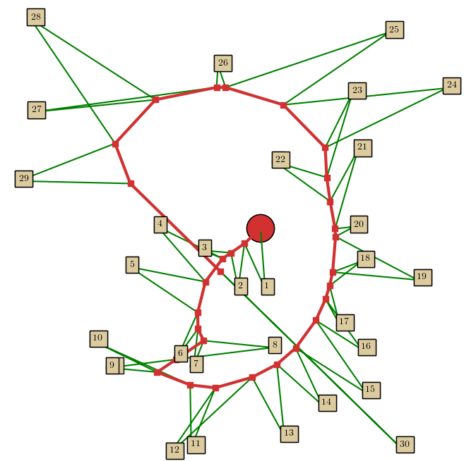

= Experimental Algorithms For Horsefly-type Problems

The Horsefly problem is a generalization of the well-known Euclidean Traveling Salesman Problem. 
In the most basic version of the Horsefly problem, which we call the "classic" horsefly, we are 
given a set of sites in the Euclidean plane, the initial position of a truck (horse) with a drone 
(fly) mounted on top, and the speed of the drone $\varphi$. 
footnote:[The speed of the truck is always assumed to be 1.]
footnote:[$\varphi$ is also called the speed ratio. ]

The goal is to compute a tour for both the truck and the drone to deliver package to sites
as quickly as possible. For delivery, a drone must pick up a package from the 
truck, fly to the site and come back to the truck to pick up the next package for 
delivery to another site. Both the truck and drone must coordinate their motions to minimize 
the time it takes for all the sites to get their packages, i.e. minimize the makespan of the
delivery process. 

This suite of programs implement several experimental heuristics, to approximately solve this NP-hard 
problem and some of its variations. 

Please see `*horseflies.pdf*` in the `tex` folder for a full description of the installation 
instructions, possible variations on Classic Horsefly and the correponding programs for solving them 
written in a http://www.literateprogramming.com/knuthweb.pdf[literate] format.
footnote:[The specific software that I used to write these literate programs was  
http://nuweb.sourceforge.net/nuweb.pdf[Nuweb]  ]
